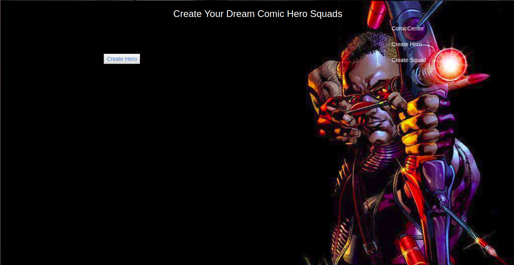
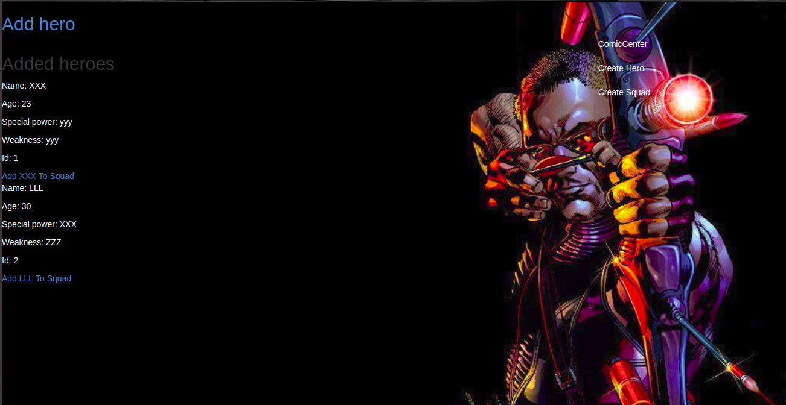
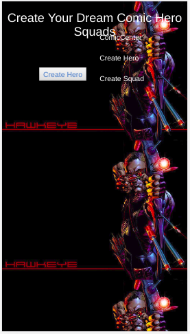
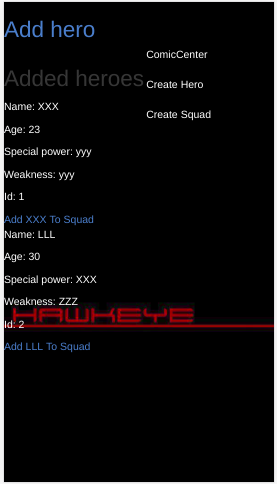

# HeroSquad by Davis

# Description

app that allows you to recruit a well-balanced team of superheroes (or any other character-type of your choosing).

This project was generated with Java version 12.

## BDD

|Input   | Output |
| ------------- | ------------- |
| Create Hero  | User Enters,age,powers and weakness  |
| Submit | Success message the hero has been created|
|See heroes| List of existing and added heroes|

|Input   | Output |
| ------------- | ------------- |
| Add Squad  | User Enters,age,powers and weakness  |
| Submit | Success message the hero has been created|
|See Squad| List of existing and added heroes|

## Desktop view

## Technologies Used

1.Java
2.HTML
3.CSS
4.Handlebars
5.Spark

## Contact Details

Email [Davis](davisdavy96@gmail.com)
Slack @Davis W

## Licence

MIT License

Copyright (c) [2019] [Davis Wafula]

Permission is hereby granted, free of charge, to any person obtaining a copy
of this software and associated documentation files (the "Software"), to deal
in the Software without restriction, including without limitation the rights
to use, copy, modify, merge, publish, distribute, sublicense, and/or sell
copies of the Software, and to permit persons to whom the Software is
furnished to do so, subject to the following conditions:

The above copyright notice and this permission notice shall be included in all
copies or substantial portions of the Software.

THE SOFTWARE IS PROVIDED "AS IS", WITHOUT WARRANTY OF ANY KIND, EXPRESS OR
IMPLIED, INCLUDING BUT NOT LIMITED TO THE WARRANTIES OF MERCHANTABILITY,
FITNESS FOR A PARTICULAR PURPOSE AND NONINFRINGEMENT. IN NO EVENT SHALL THE
AUTHORS OR COPYRIGHT HOLDERS BE LIABLE FOR ANY CLAIM, DAMAGES OR OTHER
LIABILITY, WHETHER IN AN ACTION OF CONTRACT, TORT OR OTHERWISE, ARISING FROM,
OUT OF OR IN CONNECTION WITH THE SOFTWARE OR THE USE OR OTHER DEALINGS IN THE
SOFTWARE.
